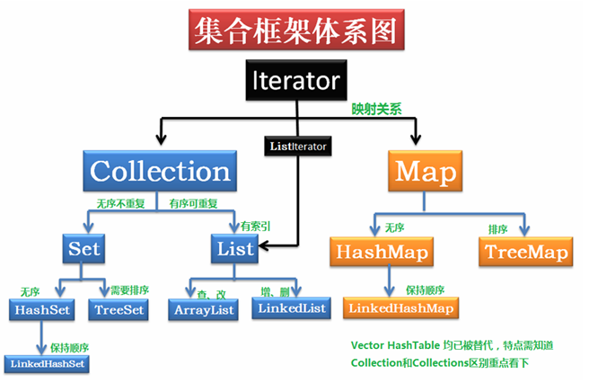
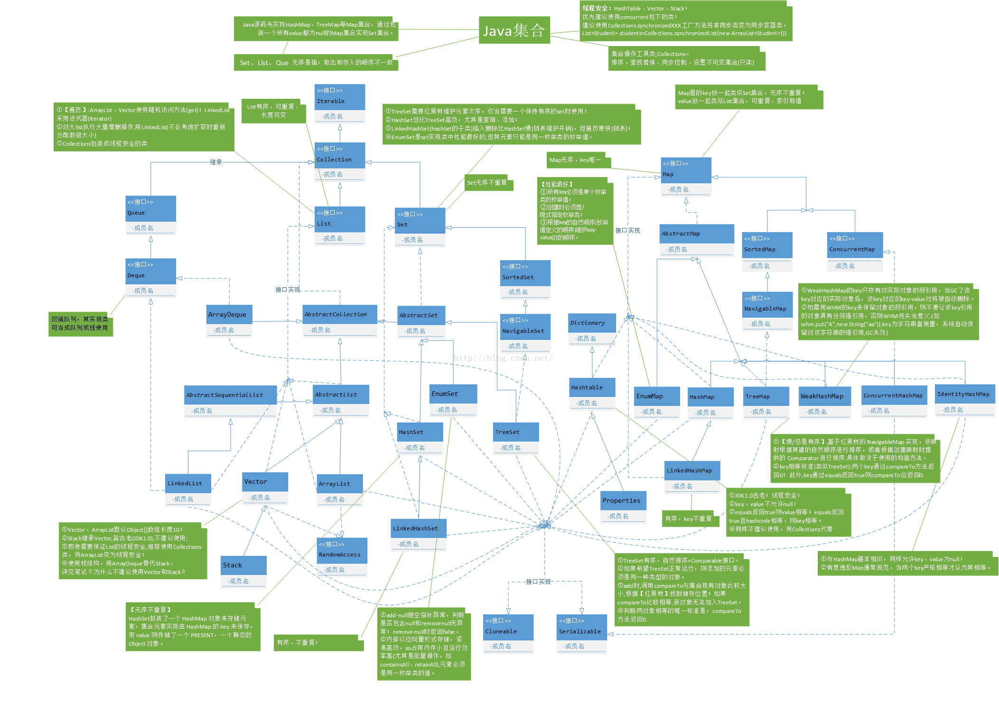
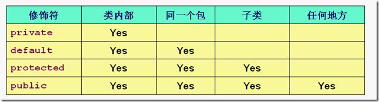

## 集合部分：


### 集合继承关系图：




### 集合安全性：


### HashMap解决冲突的方法，Java里面怎么实现的？
HashMap中调用hashCode()方法来计算hashCode。
由于在Java中两个不同的对象可能有一样的hashCode,所以不同的键可能有一样hashCode，从而导致冲突的产生。

Java中HashMap的存储是通过数组和链表存储的，解决冲突是通过拉链法，也有人称之为链表法

> 除此之外，哈希表解决冲突的方法还有：开放定址法，在哈希法


### HashMap怎么扩容？为什么容量是2的幂？

以下是散列函数
```
if ((p = tab[i = (n - 1) & hash]) == null)
            tab[i] = newNode(hash, key, value, null);
static final int hash(Object key) {
    int h;
    return (key == null) ? 0 : (h = key.hashCode()) ^ (h >>> 16);
}
```
散列的哈希值是通过key的哈希值,然后与他的哈希值无符号左移16位做异或运算
**当容量一定是2^n时，h & (length - 1) == h % length**  

Hashmap的扩容需要满足两个条件：当前数据存储的数量（即size()）大小必须大于等于阈值；当前加入的数据是否发生了hash冲突。

因为上面这两个条件，所以存在下面这些情况  
（1）、就是hashmap在存值的时候（默认大小为16，负载因子0.75，阈值12），可能达到最后存满16个值的时候，再存入第17个值才会发生扩容现象，因为前16个值，每个值在底层数组中分别占据一个位置，并没有发生hash碰撞。  
（2）、当然也有可能存储更多值（超多16个值，最多可以存26个值）都还没有扩容。原理：前11个值全部hash碰撞，存到数组的同一个位置（这时元素个数小于阈值12，不会扩容），后面所有存入的15个值全部分散到数组剩下的15个位置（这时元素个数大于等于阈值，但是每次存入的元素并没有发生hash碰撞，所以不会扩容），前面11+15=26，所以在存入第27个值的时候才同时满足上面两个条件，这时候才会发生扩容现象。

<u>其次hashMap当某个元素下面的存储的数据超过8的时候，他就不单纯的是利用链表存储数据的，他会转化为一颗红黑树来维持查询效率</u>

 

### Java提供和支持创建抽象类和接口。它们的实现有共同点，不同点在于：
* 接口中所有的方法隐含的都是抽象的。而抽象类则可以同时包含抽象和非抽象的方法。

* 类可以实现很多个接口，但是只能继承一个抽象类

* 类可以不实现抽象类和接口声明的所有方法，当然，在这种情况下，类也必须得声明成是抽象的。

* 抽象类可以在不提供接口方法实现的情况下实现接口。

* Java接口中声明的变量默认都是final的。抽象类可以包含非final的变量。

* Java接口中的成员函数默认是public的。抽象类的成员函数可以是private，protected或者是public。

* 接口是绝对抽象的，不可以被实例化，抽象类也不可以被实例化。  

  

  > **抽象类是对一种事物的抽象，即对类抽象，而接口是对行为的抽象。**  

  

### java 继承函数的执行顺序：
父类B静态代码块->子类A静态代码块->父类B非静态代码块->父类B构造函数->子类A静态代码块->子类A构造函数

<u>这里需要注意一个问题，当对象上转型的时候，执行的方法永远都是子类的方法，不会是父类的方法。</u>

#### 某个类的初始化顺序：

类成员变量的对象构造函数->类本身构造函数


### java类加载机制：
Class文件由类装载器装载后，在JVM中将形成一份描述Class结构的元信息对象，通过该元信息对象可以获知Class的结构信息：如构造函数，属性和方法等，Java允许用户借由这个Class相关的元信息对象间接调用Class对象的功能。
虚拟机把描述类的数据从class文件加载到内存，并对数据进行校验，转换解析和初始化，最终形成可以被虚拟机直接使用的Java类型，这就是虚拟机的类加载机制。

(1) 装载：查找和导入Class文件；

(2) 链接：把类的二进制数据合并到JRE中；

    (a)校验：检查载入Class文件数据的正确性；
    
    (b)准备：给类的静态变量分配存储空间，这个地方会对成员变量进行0值初始化，当然静态变量是赋初值，也就是程序给的值
    
    (c)解析：将符号引用转成直接引用；

(3) 初始化：对类的成员变量进行初始化

**注：笔者要说明的一个问题是，类加载过程中有两次赴值的过程，第一次是赋0值，第二次是针对数据做初始化**


### 修饰符的作用域：



### 当我们执行new Object()的时候，JVM做了什么？

类加载 -> 加载一个class对象，放入到方法区中，之后在对象初始化的过程中，会在堆中分配一块内存，让栈中的引用指向他，堆中会创建一个指针，指向方法区中的那个class对象。


### JDK提供的用于并发编程的同步器有哪些?
最常用的同步器是CountDownLatch和Semaphore，不常用的是Barrier 和Exchanger
A，Java 并发库 的Semaphore 可以很轻松完成信号量控制，Semaphore可以控制某个资源可被同时访问的个数，通过 acquire() 获取一个许可，如果没有就等待，而 release() 释放一个许可。  
B，CyclicBarrier 主要的方法就是一个：await()。await() 方法没被调用一次，计数便会减少1，并阻塞住当前线程。当计数减至0时，阻塞解除，所有在此 CyclicBarrier 上面阻塞的线程开始运行。  
C，直译过来就是倒计数(CountDown)门闩(Latch)。倒计数不用说，门闩的意思顾名思义就是阻止前进。在这里就是指 CountDownLatch.await() 方法在倒计数为0之前会阻塞当前线程。  

### CountDownLatch 与 CyclicBarrier的区别
* CountDownLatch简单的说就是一个线程等待，直到他所等待的其他线程都执行完成并且调用countDown()方法发出通知后，当前线程才可以继续执行。  
* cyclicBarrier是所有线程都进行等待，直到所有线程都准备好进入await()方法之后，所有线程同时开始执行！  
* CountDownLatch的计数器只能使用一次。而CyclicBarrier的计数器可以使用reset() 方法重置。所以CyclicBarrier能处理更为复杂的业务场景，比如如果计算发生错误，可以重置计数器，并让线程们重新执行一次。  
* CyclicBarrier还提供其他有用的方法，比如getNumberWaiting方法可以获得CyclicBarrier阻塞的线程数量。isBroken方法用来知道阻塞的线程是否被中断。如果被中断返回true，否则返回false。  

### BIO | NIO | AIO 以Java的角度，理解

BIO，同步阻塞式IO，简单理解：一个连接一个线程
NIO，同步非阻塞IO，简单理解：一个请求一个线程
AIO，异步非阻塞IO，简单理解：一个有效请求一个线程
BIO
在JDK1.4之前，用Java编写网络请求，都是建立一个ServerSocket，然后，客户端建立Socket时就会询问是否有线程可以处理，如果没有，要么等待，要么被拒绝。即：一个连接，要求Server对应一个处理线程。

NIO
在Java里的由来，在JDK1.4及以后版本中提供了一套API来专门操作非阻塞I/O，我们可以在java.nio包及其子包中找到相关的类和接口。由于这套API是JDK新提供的I/O API，因此，也叫New I/O，这就是包名nio的由来。这套API由三个主要的部分组成：缓冲区（Buffers）、通道（Channels）和非阻塞I/O的核心类组成。在理解NIO的时候，需要区分，说的是New I/O还是非阻塞IO,New I/O是Java的包，NIO是非阻塞IO概念。这里讲的是后面一种。

NIO本身是基于事件驱动思想来完成的，其主要想解决的是BIO的大并发问题： 在使用同步I/O的网络应用中，如果要同时处理多个客户端请求，或是在客户端要同时和多个服务器进行通讯，就必须使用多线程来处理。也就是说，将每一个客户端请求分配给一个线程来单独处理。这样做虽然可以达到我们的要求，但同时又会带来另外一个问题。由于每创建一个线程，就要为这个线程分配一定的内存空间（也叫工作存储器），而且操作系统本身也对线程的总数有一定的限制。如果客户端的请求过多，服务端程序可能会因为不堪重负而拒绝客户端的请求，甚至服务器可能会因此而瘫痪。

NIO基于Reactor，当socket有流可读或可写入socket时，操作系统会相应的通知引用程序进行处理，应用再将流读取到缓冲区或写入操作系统。 
也就是说，这个时候，已经不是一个连接就要对应一个处理线程了，而是有效的请求，对应一个线程，当连接没有数据时，是没有工作线程来处理的。

AIO
与NIO不同，当进行读写操作时，只须直接调用API的read或write方法即可。这两种方法均为异步的，对于读操作而言，当有流可读取时，操作系统会将可读的流传入read方法的缓冲区，并通知应用程序；对于写操作而言，当操作系统将write方法传递的流写入完毕时，操作系统主动通知应用程序。 
即可以理解为，read/write方法都是异步的，完成后会主动调用回调函数。 
在JDK1.7中，这部分内容被称作NIO.2，主要在java.nio.channels包下增加了下面四个异步通道：

AsynchronousSocketChannel
AsynchronousServerSocketChannel
AsynchronousFileChannel
AsynchronousDatagramChannel
其中的read/write方法，会返回一个带回调函数的对象，当执行完读取/写入操作后，直接调用回调函数。

### JSP内置对象：
JSP中一共预先定义了9个这样的对象，分别为：request、response、session、application、out、pagecontext、config、page、exception
[解释地址](https://blog.csdn.net/mao834099514/article/details/78697079)

### Java类加载器：
* 启动类加载起（Bootstrap ClassLoader）：加载JDK的核心类库，也就是JAVA-HOME/lib下的核心类库 由c++编写
* 扩展类加载器（extendsion ClassLoader）: 加载java的一些扩展类库， 这个加载器可以由开发者自主调用
* 应用程序类加载器（application ClassLoader）: 应用程序类加载器，系统默认的加载器，加载用户路径下的类以及用户自己编写的类

### 加载器双亲委派机制：
这个其实是说：应用程序类加载器继承扩展类加载器，扩展类加载起继承启动类加载器。
这里当加载一个类的时候，加载器会直接将加载任务向上委托，到达顶级加载器的时候，如果顶级加载器能加载的话，那么就成功返回，如果不能，则向下委托，指导成功加载类返回。

### 双亲委派模型的破坏——SPI
双亲委派模型虽然规定了java的层级，但是还是有一些局限性，比如如果有rt中的类需要配合应用类加载器能够加载的类，这样的话根据类加载器模型，他因为还是会调用启动类加载器，所以无法加载用户编写的类，比如反射就是一个典型。在这样的情况下，我们添加了一个线程上下文加载器的概念，通过上下文加载器可以获取到当前使用的加载器，从而得到应用类加载器。
    
### 双亲委派模型的破坏——热部署
热部署是指动态的部署一个类文件，比如tomcat中的jsp文件，实际上也是一个class文件，如果我们运行tomcat，实际上是可以做到在项目运行的时候动态修改一个jsp文件的。那么这种操作是如何做到的呢？就是tomcat可以在运行的时候动态更换类加载器，用新的类加载器加载jsp文件，这样加载出来的类不在一个类加载器的命名空间下，所以不是同一个类，可以复用。这个时候的类加载器也不是层级结构，不会去启动类加载器里查询的过程，直接根据代码动态加载了。

### hashcode的作用以及重写hascode需要注意的事项：
hashCode计算出来的哈希码便是它们的身份证。哈希码的存在便可以： 
快速定位对象，提高哈希表集合的性能。
只有当哈希表中对象的索引即hashCode和对象的属性即equals同时相等时，才能够判断两个对象相等。
从上面可以看出，哈希码主要是为哈希表服务的，其实如果不需要使用哈希表，也可以不重写hashCode。但是SUN公司应该是出于对程序扩展性的考虑（万一以后需要将对象放入哈希表集合中），才会规定重写equals的同时需要重写hashCode，以避免后续开发不必要的麻烦。
合理地组合实例域的散列码，让各个不同对象产生的散列码更加均匀

### Java异常总结：
1. NullPointException:空指针异常，一般情况出现在对象没有初始化，就调用异常  
2. ArrayIndexOutOfBoundsException:数据越界异常  
3. StackOverflowError: 栈溢出异常，如果线程请求的深度超过虚拟机允许的线程深度，那么就会抛出这个异常
```aidl
* 是否有递归
* 是否有大量循环或者死循环
* 全局变量过多
* 数组，list，map过大  
```
4. OutOfMemoryError: 内存申请异常， 当程序申请的大于当前虚拟机堆栈汇总剩余的内存，就会抛出这个异常
5. NumberFormatException: 数据转化异常
6. NoSuchMethodException：方法没有找到的异常，在使用反射的时候可能会出现的问题，有些反射的方法只能获取共有方法，而不能获取私有方法，所以可能会出现这些问题，当然也可能确实不存在这个问题  
7. ClassNotFoundException: 类对象没有找到，一般出现在项目共一个开发平台赚到另外一个开发环境中去
8. SQLException: 数据库异常
9. IOException: 输入输出异常

### Java范型的好处：
1.集合类型元素在运行期出现类型装换异常，增加编译时类型的检查  
2. 解决的时重复代码的编写，能够复用算法  

### cookies和session的区别：
1 cookie是存储在被浏览器中，session是存储在服务器端
2 cookies能存储的数据量比较小，只能存储大概4KB左右

### 如何保证cookies的安全：
1 对cookies进行加密
2 设置cookies为httpOnly 也就是禁止js操作cookies
3 为cookies中sessionId设置过期时间

### 内存溢出和内存泄漏：
内存溢出：简单说就是程序需要申请的内存，JVM已经无法分配出来了，就比如一个Integer的数据赋值了一个Long数据，就是内存溢出  
内存泄漏：是指程序在申请内存后，无法释放已申请的内存空间，一次内存泄露危害可以忽略，但内存泄露堆积后果很严重，无论多少内存,迟早会被占光。  

内存溢出的原因：
* 内存中加载的数据量过于庞大，如一次从数据库取出过多数据；

* 集合类中有对对象的引用，使用完后未清空，使得JVM不能回收；

* 代码中存在死循环或循环产生过多重复的对象实体；

* 使用的第三方软件中存在BUG；

* 启动参数内存值设定的过小；

  

### 内存泄漏的具体情况：
* 单例模式造成的内存泄漏，单例的生命周期和应用程序一样长，如果单例对象中某个对象被引用了，那么之后不需要的时候，他也不会被GC
解决方案：通过一个set方法来修改单例对象中的对象引用，这样一来释放了之前的对象
* 非静态内部类创建静态类实例： 这样的话每次创建类对象的时候都会创建一个静态类引用。  
* 资源未关闭造成的内存泄漏  
* 集合容器中的内存泄漏，特别是static就更严重了。


### 加密算法：

对称加密：aes，des，3des

非对称加密：rsa，dsa，rcc

信息摘要加密：md5,sha1,hmac (区别不可逆，，，)

base64编码：非安全领域的加密算法，只是一个编码的方式

RSA对AES的公共密钥进行加密，生成密钥对，然后存储到另外一台服服务器上


### MD5的实现原理：

md5是一种信息摘要算法，主要是通过特定的hash散列方法将文本信息转换成简短的信息摘要，压缩+加密+hash算法的结合体，是绝对不可逆的。

**计算步骤：**

1.填充：将加密的数据长度进行填充，填充至长度%512=448，为什么是448，保留64位存储数据长度。最终结果是（n+1）* 512位大小。

2.初始化数据：初始化四个初始值，以及四个hash函数

3.处理分组数据：分为（n+1）轮，每一轮对512位数据进行处理，512位分为16组，每组32位，然后通过四轮循环，对数据进行处理，以此类推，然后最终得到四个32位的值，将其合在一起就是最后的md5值，也就是128位。


### Integer 对象在-128到127的时候，使用==判断是true，超过这个范围就为false，是为什么？

其实也很简单，当自动装箱的时候，Java会创建一个缓存，当创建的元素在这个范围内的时候，就会直接传出当前缓存数组中的数据。如果不在当前范围内的话，就会重新创建一个数据。

```java
public static Integer valueOf(int i) {
    if (i >= IntegerCache.low && i <= IntegerCache.high)
    	return IntegerCache.cache[i + (-IntegerCache.low)];
    return new Integer(i);
}
//以上是Java1.8的源码 需要注意的一点是low初始化为-128， 但是high是可以配置更改的，默认是127
```

