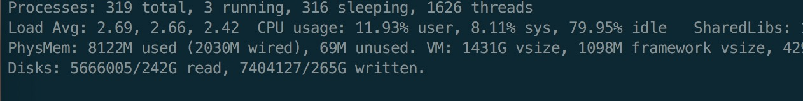

### 硬链接和软连接区别
链接简单说实际上是一种文件共享的方式，是 POSIX 中的概念，主流文件系统都支持链接文件。  
可以将链接简单地理解为 Windows 中常见的快捷方式（或是 OS X 中的替身），Linux 中常用它来解决一些库版本的问题，通常也会将一些目录层次较深的文件链接到一个更易访问的目录中。在这些用途上，我们通常会使用到软链接（也称符号链接）。  
硬链接： 与普通文件没什么不同，inode 都指向同一个文件在硬盘中的区块
软链接： 保存了其代表的文件的绝对路径，是另外一种文件，在硬盘上有独立的区块，访问时替换自身路径。

### 文件权限：
r-4  w-2  x-1

### 循环执行的命令
基本格式 :  
*　　*　　*　　*　　*　　command  
分　 时　 日　 月　 周　 命令  
第1列表示分钟1～59 每分钟用*或者 */1表示  
第2列表示小时1～23（0表示0点）  
第3列表示日期1～31  
第4列表示月份1～12  
第5列标识号星期0～6（0表示星期天）  
第6列要运行的命令   

### 用户态切换到内核态的  3  种方式  
a.  系统调用  
b.  异常  
c.  外围设备的中断   


### CPU load值是干什么的？



注意到 load avg：这三个值是表示1分钟，5分钟，15分钟的时候系统平均负载

系统平均负载：在特定时间间隔内运行队列中（在CPU上运行或者等待的进程）的平均进程数


### 什么因素影响了cpuload的大小：

衡量CPU 系统负载的指标是load,load 就是对计算机系统能够承担的多少负载的度量,简单的说是进程队列的长度。**请求大于当前的处理能力，会出现等待，引起load升高。**

 

### cpu load 过高原因以及排查

造成cpu load过高的原因.从编程语言层次上full gc次数的增大或死循环都有可能造成cpu load 增高

具体的排查一句话描述就是

```
首先要找到哪几个线程在占用cpu,之后再通过线程的id值在堆栈文件中查找具体的线程，看看出来什么问题。1
```

**寻找最占CPU的进程**

> - 通过命令 ps ux
> - 通过top -c命令显示进程运行信息列表 (按键P按CPU占有资源排序)

**寻找最耗CPU的线程**

> - top -Hp 进程ID 显示一个进程ID的线程运行信息列表 (按键P按CPU占有资源排序) 
>   如果该进程是java进程，需要具体查看是哪段代码造成的CPU负载过高，根据上述获得到的线程ID可以使用JDK下的jstack来查看堆栈。

由于在堆栈中线程id是用16进制表示的，因此可以将上述线程转化成16进制的表示。

```
jstack java进程id  | grep 16进制的线程id  -C5 --color
```
### Linux中关于文件区分的问题：

Linux系统中，每个文件都有一个自己的inode节点，用来存储的文件的元信息，每个文件都有自己的inode号，linux通过这个号码来区分每一个文件。

软链接：指向原来存在的inode，这个inode中存储的是文件的地址，每次使用软链接访问文件，都是转向到具体的地址，相当于快捷方式。如果删除了原文件，那么在使用软链接访问就会报错。

硬链接：多个文件名指向同一个inode号，可以使用多个文件名对同一个文件进行修改，删除一个文件名，对原文件不会产生影响


### 从目录树中读取某个文件过程

1. 因为文件名是记录在目录的block当中，因此当我们要读取某个文件时，就一定会经过目录的inode与block ，然后才能够找到那个待读取文件的inode号码，最终才会读到正确的文件的block内的资料。
2. 由于目录树是由根目录开始，因此操作系统先通过挂载信息找到挂载点的inode号，由此得到根目录的inode内容，并依据该inode读取根目录的block信息，再一层一层的往下读到正确的文件。


### Linux 文件系统：

文件系统包括如下内容：

* 文件名与inode的对应表：
* inode
* 具体的数据域


每个inode中存储一些文件的元信息，也存储了具体的文件数据的地址，每个inode默认有15个索引，每个索引大小4B（没错就是4个字节），一共60B。这15个索引分为三个索引层级，直接索引，一级间接索引，二级，三级。

每个索引指向一个数据块block（linux一般为1KB，2KB，4KB），所谓二级索引就是索引指向的block中并不是具体的数据，而是索引，然后索引在指向具体的数据。

所以，Linux中单个文件的上限，取决于block的大小，这里有：

| block的大小 | 单个文件的最大大小 |
| ----------- | ------------------ |
| 1KB         | 16G                |
| 2KB         | 256G               |
| 4KB         | 2TB                |


而文件与文件夹的区别在于，文件存储的是下一个目录中，所有文件的文件名和inode号的对应表