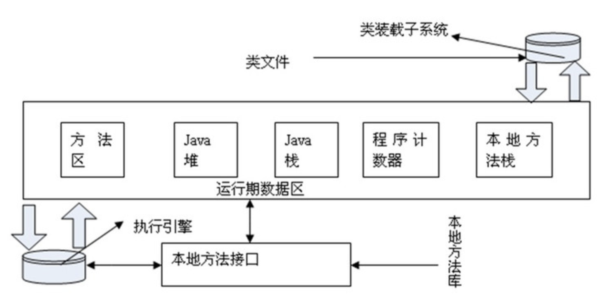

### Java虚拟机的内存模型：

好吧，图是偷来的

* 方法区：存储编译后类的信息，常量以及静态变量，这其中还有一块内存区域叫做运行时常量池：主要存储了编译是生成的各种字面量和符号引用
* JAVA堆：大部分对象的存储区域
* Java栈：线程私有的的区域，为每个线程的执行提供私有空间
* 程序计数器：一个记录程序执行指令行数的工具，这个也是线程私有的东西
* 本地方法栈：调用其他语言的方法栈，当执行这类方法的时候，程序计数器为0

### 对象存储的信息：
对象头：
    对象自身的运行数据
    指向类元数据的指针
实例数据真正的实体信息
对齐填充字节：这是因为对象存储的时候必须是8的整数倍，所以当对象分配的内存值不是8的整数倍，这一部分则会进行填充。

### 对象内存的分配方式：
    指针碰撞：也就是每一个分配空间只需要将堆顶部的空间指针往后移动相应的空间就好，这种方式基于标记-整理（mark-compact）的垃圾回收算法实现
    空闲列表：每次在堆空间中找到适合的大小的空间，对数据进行存储，这种方式基于标记-清除算法（mark-sweep）实现
    
### 垃圾收集器与内存分配策略：

* 那些对象会被回收？如何检测？
很多语言都采取的对象计数的方式进行对象回收，然后java语言是采用的**可达性分析算法**进行回收，什么是可达性分析算法，就是通过判断对象通过GCRoots是否可以到达，如果可以到达，则说明对象仍然在使用，不能回收，但是如果不能到达的话，则进行第一次标记，标记他可以被回收。
* 能作为GC roots的对象有哪些？ 
1. 栈中被引用的对象
2. 方法区中的静态变量引用的对象
3. 方法区中常量引用的对象
4. 本地方法中引用的对象

### 引用的类型：存在的目的:是为了让程序员能更好的控制对象的生命周期
* 强引用（strong-reference）：一般情况下，对象的直接关联都叫强引用 引用在，就不会被回收 object o = new object(); 
* 软引用（soft-reference）：这种引用只在内存不够的情况下，才会被回收 softreference wr = new softreference(o); 
* 弱引用（weak-reference）：这种引用只能活到下一次GC之前 weakreference t = new  weakreferencez(o);
* 虚引用（记不得了）：这种相当于没有，只是会在GC的时候，留下痕迹 这种东西，讲道理，我是不太会用。。。
注：笔者想要说的一点是，引用是针对对象而言的，引用的创建必然依赖于对象

***对象的死亡过程要经历两次标记，第一次是在可达性分析的时候，进行的标记，其次是在之后的回收中在进行一次标记，也就是说这个过程中，对象有一次自我救赎的机会，也就是在调用finalize()中重新恢复对象的引用，好吧，这种操作完全是浪费时间**

### 方法区的垃圾回收：
有些虚拟机对这一块内存并不进行垃圾回收，因为想对于新生代的垃圾回收率来讲，这一块能回收到的空间并不多，但是此处仍然需要说明：对方法区的内存回收主要是两个内容：常量和无用的类，对于常量而言，回收比较简单，直接判断程序中是否存在名字一样的常量，如果没有，则回收，但是对于无用的类来讲，是比较困难的，此处略。

### 垃圾回收算法：
Mark-sweep（标记-清除）算法：主要用于Full GC  
Cpoying（复制）算法：主要用于minor GC  
Mark-compact(标记-整理算法)：主要用于Full GC  

### 堆内存的规划：
新生代：
    Eden space：
    from survivor：
    to survivor:
    上述比例：8:1:1
    
老生代：

对象回收时，将eden和一块survivor的对象转到另外一块上，如果不够放的话，则进行分配担保，进入老年代。

当GC开始的时候，必须要停止虚拟机中所有的动作，以便保证对象标记的正确性，sun管这个叫做“stop the world”,那也就是说需要一个安全点，然后在这个时刻进行回收标记，这里采用的是一种**主动式中断思想**，也就是线程主要去轮询这个点，如果需要，则线程挂起等待。当然也有一些额外的情况，也就是这个安全点的时刻，一些线程本身就处于休眠状态，那么很有可能就错过了这个安全点的轮询，为了避免这种情况，所以将安全点扩充成安全域，也就是在一短时间内，线程进入了，都会自动挂起，方便标记。

垃圾收集器：
垃圾收集器实际上是垃圾回收算法的理论实现，垃圾回收算法是理论知识，垃圾收集器是实现。

垃圾收集器的种类：
serial收集器：  
parNew收集器：  
CMS收集器：  
parallel scavenge收集器：  
serial old收集器：  
parent old收集器：  
g1收集器：  
搭配种类繁多，自行百度

说到这里，我们必须要明确一个问题，java的内存自动管理包括哪些问题：
* 内存自动分配
* 内存自动回收

上述着重简介了对象的回收，那么接下来讲一讲，内存的自动分配：
给对象分配内存的时候，如果eden的空间不足的话，则会出发一次minor GC，如果回收结束以后仍然不够存的话，就会把内存分配到from survivor中，如果还不够放的话，那就采用提前担保机制，将对象分配到老年代中，
对于每一个对象而言，她们都有一个年龄计数器，对象在eden出生之后，如果熬过了第一次minor GC的话，则年龄+1，被jvm放入到第一块survivor中，之后每经过一个minor gc，年龄+1，当年龄到达一个阀值（默认15）的时候，则将对象转移到老年代中。
当然进入老年代这并不是唯一的途径，当survivor中同一年龄的对象的内存和大雨survivor的一半的时候，那么大于或者等于这个年龄的对象就可以直接进入老年代中。这个叫做**动态对象年龄判断**。

### 空间担保分配：
在进行一次minor GC之前，如果老年代中剩余的空间足以容纳新生代中所有的对象，则Minor gc 继续执行，否则就要判断虚拟机是否允许担保失败，如果不允许就直接惊醒Full GC，如果允许的话，就把当前老年代中剩余的内存空间和往届新生代转老年代的平均值做比较，如果小于的话，Full GC，如果大于的话，执行minor GC，这里就有可能出现实现新生代中转到老生代中需要的内存大于剩余的内存，那么也就是担保失败了，就需要重新进行Full GC，这样的方式相当于兜了一大个圈子，但是从某种角度上来讲，这种方式有效的降低了Full GC的次数。

### JVM堆参数：
-Xmx：最大堆大小  
-Xms：初始堆大小  
-Xmn:年轻代大小  
-XXSurvivorRatio：年轻代中Eden区与Survivor区的大小比值  

### 垃圾收集器：
serial：串行垃圾收集器，单线程进行垃圾回收，在新生代内存比较小的情况下，使用serial是一种比较理想的选择  新生代 复制算法  老生代 标记整理算法  
parNew：serial的并行版本，第一款运行在服务端的垃圾收集器 新生代垃圾收集器  
Parllel Scavenge：新生代垃圾收集器 复制算法 专注于提高吞吐量的垃圾收集器  
serial Old：serial 的老年代垃圾收集器算法 使用标记整理算法  
Parllel Old：parllel 老生代垃圾收集器 多线程标记整理算法  
CMS：
CMS(Concurrent Mark Sweep)收集器是一种以获取最短回收停顿时间为目标的收集器。目前很大一部分的Java应用集中在互联网站或者B/S系统的服务端上，这类应用尤其重视服务器的响应速度，希望系统停顿时间最短，以给用户带来较好的体验。CMS收集器就非常符合这类应用的需求

CMS收集器是基于“标记-清除”算法实现的。它的运作过程相对前面几种收集器来说更复杂一些，整个过程分为4个步骤：  
（1）初始标记：标记GC roots 能够关联的对象  
（2）并发标记：正式标记那些要被回收的对象
（3）重新标记：纠正并发标记期间 程序运行对象引用发生的变化
（4）并发清除：清除垃圾

CMS的优点：并发收集，低停顿  
CMS缺点：
* 因为CMS垃圾收集器是随着用户线程一并执行的垃圾回收算法，所以当CPU的比较少的时候，就会造成CPU的运算加大，导致性能下降
* 因为CMS是随着用户线程进行的，所以在收集期间，对新生成的垃圾无法回收，这个叫浮动垃圾，只能等下一次垃圾回收。那么问题就是垃圾收集的时候，还有留下足够的空间保证程序的正确执行，如果在这个过程中内存又不够用了，那么JVM会采取备用方案进行垃圾回收。
* 标记清除会造成大量的内存碎片；CMS设置了一个参数，在一定条件下会对内存进行整理

G1：服务端应用的垃圾收集器。
特点：
* 并发与并行：G1能充分利用CPU、多核环境下的硬件优势，使用多个CPU（CPU或者CPU核心）来缩短stop-The-World停顿时间。部分其他收集器原本需要停顿Java线程执行的GC动作，G1收集器仍然可以通过并发的方式让java程序继续执行。  
* 分代收集算法：
* 空间整理算法：G1从整体来看是基于“标记整理”算法实现的收集器；从局部上来看是基于“复制”算法实现的。  
* 可预测停顿：这是G1相对于CMS的另一个大优势，降低停顿时间是G1和ＣＭＳ共同的关注点，但Ｇ１除了追求低停顿外，还能建立可预测的停顿时间模型，能让使用者明确指定在一个长度为M毫秒的时间片段内，

具体步骤：
* 初始标记
* 并发标记
* 最终标记
* 筛选回收

### JVM调优技巧：
[大佬的调优技巧](https://blog.csdn.net/wuzhilon88/article/details/49201891)

### JVM的内存分配方案：
静态分配，栈式分配，堆式分配
分别存储在静态存储区（方法区），堆栈

### 执行new A()的时候，JVM 做了什么工作。
首先，如果这个类没有被加载过，JVM就会进行类的加载，并在JVM内部创建一个instanceKlass对象表示这个类的运行时元数据（相当于Java层的Class对象）。初始化对象的时候（执行invokespecial A::），JVM就会创建一个instanceOopDesc对象表示这个对象的实例，然后进行Mark Word的填充，将元数据指针指向Klass对象，并填充实例变量。
元数据—— instanceKlass 对象会存在元空间（方法区），而对象实例—— instanceOopDesc 会存在Java堆。Java虚拟机栈中会存有这个对象实例的引用。
    

