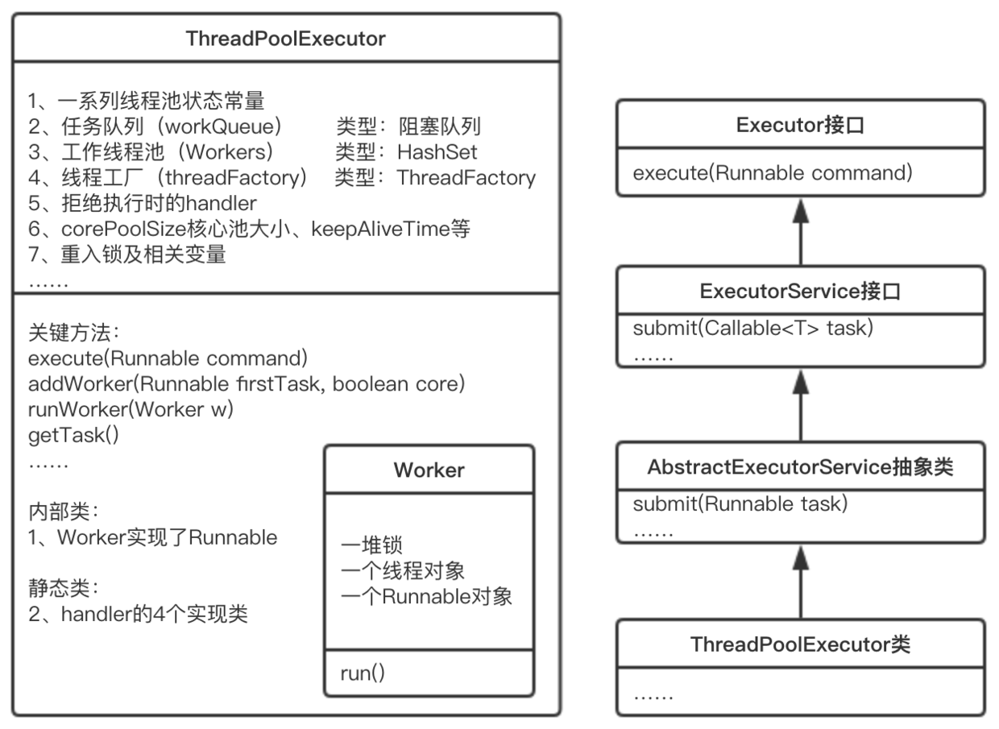

### 并发正确运行的三个条件：
* 原子性：即一个共享变量在同一时刻只能由一个线程访问
* 可见性：即一个共享变量在线程中被修改，立即在主存中得到更新
* 有序性：JVM为了提高效率会进行指令重排序多线程线，指令重排序会影响程序的正确性

### Volatile关键字怎么保证可见性？
当多个线程进行操作共享数据时，可以保证内存中的数据可见。底层原理：内存栅栏。  
使用volatile关键字修饰时，可理解为对数据的操作都在主存中进行。
两个作用，
保证内存的可见性，防止指令重排序


### Volatile关键字为什么不能保证操作的原子性？
* volatile不具备“互斥性”
* volatile不能保证变量的“原子性”
当一个共享变量被volatile修饰时，它会保证修改的值会立即被更新到主存，当有其他线程需要读取时，它会去内存中读取新值。
简单讲就是当两个线程在同一时刻获得被修饰的变量，然后在分别写入，那么就又会有一个操作是没有用的。
当需要使用被volatile修饰的变量时，线程会从主内存中重新获取该变量的值，但当该线程修改完该变量的值写入主内存的时候，并没有判断主内存内该变量是否已经变化，故可能出现非预期的结果。如主内存内有被volatile修饰变量 a，值为3，某线程使用该变量时，重新从主存内读取该变量的值，为3，然后对其进行+1操作，此时该线程内a变量的副本值为4。但此时该线程的时间片时间到了，等该线程再次获得时间片的时候，主存内a的值已经是另外的值，如5，但是该线程并不知道，该线程继续完成其未完成的工作，将线程内的a副本的值4写入主存，这时，主存内a的值就是4了。这样，之前修改a的值为5的操作就相当于没有发生了，a的值出现了意料之外的结果。

被synchronize修饰的变量则可以保证变量操作的原子性，因为当某线程使用变量a时，其他线程无法使用变量a，只能等该线程对a操作结束，释放a的锁后才能对a进行操作。  

### 线程的五态：
1. 新建(NEW)：新创建了一个线程对象。
2. 可运行(RUNNABLE)：线程对象创建后，其他线程(比如main线程）调用了该对象的start()方法。该状态的线程位于可运行线程池中，等待被线程调度选中，获取cpu 的使用权 。

3. 运行(RUNNING)：可运行状态(runnable)的线程获得了cpu 时间片（timeslice） ，执行程序代码。
4. 阻塞(BLOCKED)：阻塞状态是指线程因为某种原因放弃了cpu 使用权，也即让出了cpu timeslice，暂时停止运行。直到线程进入可运行(runnable)状态，才有机会再次获得cpu timeslice 转到运行(running)状态。  
阻塞的情况分三种：   
(一). 等待阻塞：运行(running)的线程执行o.wait()方法，JVM会把该线程放入等待队列(waitting queue)中。  
(二). 同步阻塞：运行(running)的线程在获取对象的同步锁时，若该同步锁被别的线程占用，则JVM会把该线程放入锁池(lock pool)中。  
(三). 其他阻塞：运行(running)的线程执行Thread.sleep(long ms)或t.join()方法，或者发出了I/O请求时，JVM会把该线程置为阻塞状态。当sleep()状态超时、join()等待线程终止或者超时、或者I/O处理完毕时，线程重新转入可运行(runnable)状态。  
5. 死亡(DEAD)：线程run()、main() 方法执行结束，或者因异常退出了run()方法，则该线程结束生命周期。死亡的线程不可再次复生。


### ThreadPoolExecutor线程池中各参数的意义：
```$xslt
public ThreadPoolExecutor(int corePoolSize,
                          int maximumPoolSize,
                          long keepAliveTime,
                          TimeUnit unit,
                          BlockingQueue<Runnable> workQueue,
                          RejectedExecutionHandler handler) {
    this(corePoolSize, maximumPoolSize, keepAliveTime, unit, workQueue,
         Executors.defaultThreadFactory(), handler);
}
//仔细观察的话就会发现，上述三个构造函数，其实是调用了下面这个最厉害的构造函数，然后给其中的一些值一个默认值
/**
 * 创建一个线程池
 * parameters.
 *
 * @param corePoolSize 线程池核心数，也就是正常状态下需要维护的线程数量
 * 如果@code allowCoreThreadTimeOut参数设置了，那么他们超时就被被丢弃
 * @param maximumPoolSize 线程池允许创建的最大线程数量
 * @param keepAliveTime 空闲线程保留时间，如果线程空闲时间超过这个值，就会被杀掉
 * @param unit 上一个参数的单位 年，月，日and so on
 * @param workQueue 线程阻塞队列 当创建的线程数大于核心线程数的时候，就会把任务放进阻塞队列，如果当前队列满了的话，则看当前线程有没有超过最大线程数，没有则创建新线程来解决，超过的话，则把线程丢掉
 * 书上说这里有三种队列：也就是增长策略
 * 直接提交：默认选项是SynchronousQueue，
 * 有界队列：ArrayBlockingQueue，
 * 无界队列：LinkedBlockingQueue，
 * @param threadFactory 创建线程的工厂
 * @param handler 当线程池的任务缓存队列已满并且线程池中的线程数目达到maximumPoolSize，如果还有任务到来就会采取任务拒绝策略，通常有以下四种策略：
 * 有家伙说有以下取值： 这里有个高级的名字叫做拒绝策略
 * ThreadPoolExecutor.AbortPolicy:丢弃任务并抛出RejectedExecutionException异常。 
 * ThreadPoolExecutor.DiscardPolicy：也是丢弃任务，但是不抛出异常。
 * ThreadPoolExecutor.DiscardOldestPolicy：丢弃队列最前面的任务，然后重新尝试执行任务（重复此过程）
 * ThreadPoolExecutor.CallerRunsPolicy：由调用线程处理该任务 
 * 具体实现略

```


### 常见线程池的类型与区别：
```$xslt
public static ExecutorService newFixedThreadPool(int nThreads) {
    return new ThreadPoolExecutor(nThreads, nThreads,
                                  0L, TimeUnit.MILLISECONDS,
                                  new LinkedBlockingQueue<Runnable>());
}
public static ExecutorService newSingleThreadExecutor() {
    return new FinalizableDelegatedExecutorService
        (new ThreadPoolExecutor(1, 1,
                                0L, TimeUnit.MILLISECONDS,
                                new LinkedBlockingQueue<Runnable>()));
}
public static ExecutorService newCachedThreadPool() {
    return new ThreadPoolExecutor(0, Integer.MAX_VALUE,
                                  60L, TimeUnit.SECONDS,
                                  new SynchronousQueue<Runnable>());
}
```
要配置一个线程池是比较复杂的，尤其是对于线程池的原理不是很清楚的情况下，很有可能配置的线程池不是较优的，因此在Executors类里面提供了一些静态工厂，生成一些常用的线程池。

1. newSingleThreadExecutor

创建一个单线程的线程池。这个线程池只有一个线程在工作，也就是相当于单线程串行执行所有任务。如果这个唯一的线程因为异常结束，那么会有一个新的线程来替代它。此线程池保证所有任务的执行顺序按照任务的提交顺序执行。

2. newFixedThreadPool

创建固定大小的线程池。每次提交一个任务就创建一个线程，直到线程达到线程池的最大大小。线程池的大小一旦达到最大值就会保持不变，如果某个线程因为执行异常而结束，那么线程池会补充一个新线程。

3. newCachedThreadPool

创建一个可缓存的线程池。如果线程池的大小超过了处理任务所需要的线程，

那么就会回收部分空闲（60秒不执行任务）的线程，当任务数增加时，此线程池又可以智能的添加新线程来处理任务。此线程池不会对线程池大小做限制，线程池大小完全依赖于操作系统（或者说JVM）能够创建的最大线程大小。

4. newScheduledThreadPool

创建一个大小无限的线程池。此线程池支持定时以及周期性执行任务的需求。

### 死锁发生的条件：
**互斥条件：**进程要求对所分配的资源（如打印机）进行排他性控制，即在一段时间内某 资源仅为一个进程所占有。此时若有其他进程请求该资源，则请求进程只能等待。    
**不剥夺条件：**进程所获得的资源在未使用完毕之前，不能被其他进程强行夺走，即只能 由获得该资源的进程自己来释放（只能是主动释放)。    
**请求和保持条件：**进程已经保持了至少一个资源，但又提出了新的资源请求，而该资源 已被其他进程占有，此时请求进程被阻塞，但对自己已获得的资源保持不放。    
**循环等待条件：**存在一种进程资源的循环等待链，链中每一个进程已获得的资源同时被 链中下一个进程所请求

### 死锁的解决方案：
1.打破互斥条件，我们需要允许进程同时访问某些资源，这种方法受制于实际场景，不太容易实现条件；  

2.打破不可抢占条件，这样需要允许进程强行从占有者那里夺取某些资源，或者简单一点理解，占有资源的进程不能再申请占有其他资源，必须释放手上的资源之后才能发起申请，这个其实也很难找到适用场景；  

3.进程在运行前申请得到所有的资源，否则该进程不能进入准备执行状态。这个方法看似有点用处，但是它的缺点是可能导致资源利用率和进程并发性降低  

4.避免出现资源申请环路，即对资源事先分类编号，按号分配。这种方式可以有效提高资源的利用率和系统吞吐量，但是增加了系统开销，增大了进程对资源的占用时间。  

（1）. 最简单、最常用的方法就是进行系统的重新启动，不过这种方法代价很大，它意味着在这之前所有的进程已经完成的计算工作都将付之东流，包括参与死锁的那些进程，以及未参与死锁的进程；  

（2）. 撤消进程，剥夺资源。终止参与死锁的进程，收回它们占有的资源，从而解除死锁。这时又分两种情况：一次性撤消参与死锁的全部进程，剥夺全部资源；或者逐步撤消参与死锁的进程，逐步收回死锁进程占有的资源。一般来说，选择逐步撤消的进程时要按照一定的原则进行，目的是撤消那些代价最小的进程，比如按进程的优先级确定进程的代价；考虑进程运行时的代价和与此进程相关的外部作业的代价等因素；  

（3）. 进程回退策略，即让参与死锁的进程回退到没有发生死锁前某一点处，并由此点处继续执行，以求再次执行时不再发生死锁。虽然这是个较理想的办法，但是操作起来系统开销极大，要有堆栈这样的机构记录进程的每一步变化，以便今后的回退，有时这是无法做到的。  

<u>值得一提的是，银行家算法到底是做什么的？其实这种算法是几个策略的并集，他是为了避免死锁的发生。</u>


### 进程和线程的区别：
* 进程是资源分配的最小单位，线程是程序执行的最小单位。
* 进程有自己的独立地址空间。而线程是共享进程中的数据的，使用相同的地址空间，因此CPU切换一个线程的花费远比进程要小很多，同时创建一个线程的开销也比进程要小很多。
* 线程之间的通信更方便，同一进程下的线程共享全局变量、静态变量等数据，而进程之间的通信需要以通信的方式（IPC)进行。不过如何处理好同步与互斥是编写多线程程序的难点。
* 但是多进程程序更健壮，多线程程序只要有一个线程死掉，整个进程也死掉了，而一个进程死掉并不会对另外一个进程造成影响，因为进程有自己独立的地址空间。  

### Synchronized:实现原理
每个对象有一个监视器锁（monitor）。当monitor被占用时就会处于锁定状态，线程执行monitorenter指令时尝试获取monitor的所有权，过程如下：

1、如果monitor的进入数为0，则该线程进入monitor，然后将进入数设置为1   ，该线程即为monitor的所有者。

2、如果线程已经占有该monitor，只是重新进入，则进入monitor的进入数加1

3.如果其他线程已经占用了monitor，则该线程进入阻塞状态，直到monitor的进入数为0，再重新尝试获取monitor的所有权。

执行monitorexit的线程必须是objectref所对应的monitor的所有者。

指令执行时，monitor的进入数减1，如果减1后进入数为0，那线程退出monitor，不再是这个monitor的所有者。其他被这个monitor阻塞的线程可以尝试去获取这个 monitor 的所有权。

他是非公平锁，也是个重量级锁

### ReenTrantLock：（可重入锁）
它内部又一个AbstractQueueSynchronized的子类，用于存储堵塞队列，是一个FIFO的队列，每个Node都有自己的属性，
他有一个state表示同步状态，这一点我觉得和synchronized一样
可以通过构造方法实现公平锁和非公平锁，默认是非公平锁
tryLock可以设置获取锁的等待是时间，这样某种程度上来讲会避免死锁的发生

### CAS（compare and swap）:
CAS是一种类似于乐观锁的机制，或者说是：比较交换、if-then。在AQS和Atomic原子类等很多地方广泛应用此种方式进行加锁。计算机能够保证CAS的原子性是很关键的一个点，Unsafe是CAS调用的真正方法，这个类能够对内存进行分配，NIO的分配就基于此类。  
这里笔者想说明的一个问题是和volatile相关的，为什么volatile关键字修饰的变量不能保证多线程安全性，原因在于被volatile修饰的变量在写入的时候，并不会判断变量是否修改过，所以有可能造成数据不安全访问。
而CAS是在比较前数据是否发生了变换，变换的话，就要重新读取数据然后进行操作，没有变换的话自然就直接赋值。
当然CAS也是有缺点的，那就是ABA的问题，关于什么是ABA问题，就是数据在线程执行期间变化了，然后又变回来了，这是没有办法做到的，但是Java中提供了AtomicStampedReference来实现版本不同的cas

### 原子类：
* AtomicInteger：AtomicInteger类可以对int数据做原子的加减操作，在内部原子类是通过CAS进行多线程并发处理的。 也就是保证++ 的正确性。
* LongAdder：
* volite：

### [Java 自旋锁 偏向锁 轻量级锁 重量级锁](https://blog.csdn.net/zqz_zqz/article/details/70233767/)


