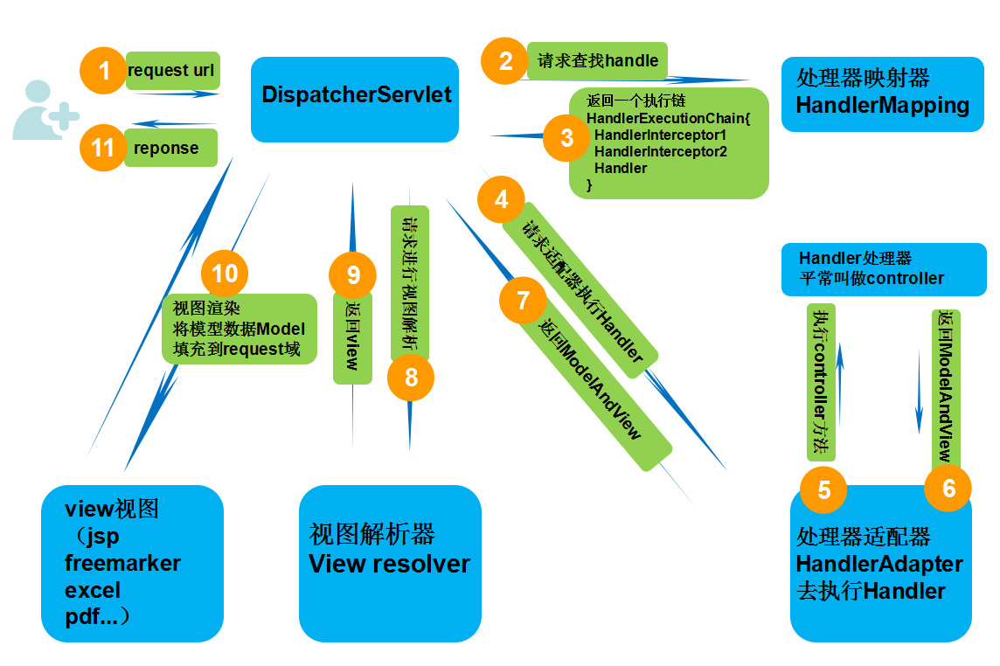

### spring的特点：
* 控制反转 IOC  
* 面向切面编程 AOP

### Spring中IOC的实现原理：
Spring当中提供了两种实例化方案： BeanUtils 和 Cglib 方式。BeanUtils实现机制是通过Java的反射机制，Cglib是一个第三方类库采用的是一种字节码加强方式机制。 Spring中采用的默认实例化策略是Cglib。 

让我们看看Spring
[java  反射](https://blog.csdn.net/sinat_38259539/article/details/71799078)

到底是怎么依赖注入的吧，其实依赖注入的思想也很简单，它是通过反射机制实现的，在实例化一个类时，它通过反射调用类中set方法将事先保存在HashMap中的类属性注入到类中。让我们看看具体它是怎么做的吧。 
首先实例化一个类.  
接着它将这个类的依赖注入进去,最后它将这个类的实例返回给我们，我们就可以用了。我们还是以Map为例看看它是怎么做的，我写的代码里面是创建一个HashMap并把该HashMap注入到需要注入的类中

### Spring中AOP的实现原理：
AOP：面向切面编程，我的理解是把某一类在相同时刻点需要执行的代码分离出来，组装成一个新的类，然后执行的时候，动态执行一些方法

这里所谓的aop编程，其实是代理模式的一种具体的实现，代理众所周知，分为静态代理和动态代理，静态代理的话就是在写代码的时候，就对对象执行一层封装，然后在方法的前后加入具体需要实现的方法；也就是在执行前，代理就知道，他要代理的对象是谁；我感觉和装饰者没什么两两样。
动态代理则是在对象执行的时候，动态添加方法的方式，为目标对象添加额外的方法；

这里主要讲动态代理的方式：
其实就是一个动态生成代码，然后在进行编译的过程。
jdk实现的代理：这里需要代理对象和目标对象都实现同一个接口，然后利用jdk的方法：
JDK中生成代理对象的API
代理类所在包:java.lang.reflect.Proxy
JDK实现代理只需要使用newProxyInstance方法,但是该方法需要接收三个参数,完整的写法是:
```
static Object newProxyInstance(ClassLoader loader, Class<?>[] interfaces,InvocationHandler h )
注意该方法是在Proxy类中是静态方法,且接收的三个参数依次为:

ClassLoader loader,:指定当前目标对象使用类加载器,获取加载器的方法是固定的
Class<?>[] interfaces,:目标对象实现的接口的类型,使用泛型方式确认类型
InvocationHandler h:事件处理,执行目标对象的方法时,会触发事件处理器的方法,会把当前执行目标对象的方法作为参数传入
```

这里要注意一点的是，使用jdk的代理一定要和目标对象实现同一个接口
cglib实现的代理：
使用cglib第三方jar动态代码生成就不需要和目标对象实现同一个接口；
Cglib子类代理实现方法:
1.需要引入cglib的jar文件,但是Spring的核心包中已经包括了Cglib功能,所以直接引入spring-core.jar即可.
2.引入功能包后,就可以在内存中动态构建子类
3.代理的类不能为final,否则报错
4.目标对象的方法如果为final/static,那么就不会被拦截,即不会执行目标对象额外的业务方法.

### 这里在Spring中只需要判断代理类是否实现了接口，然后判断使用jdk代理还是cglib代理
文末我需要申明一点的是，所谓动态代理，无非是将方法重组，然后编译执行，万变不离其宗，提供一个大佬的文章链接[戳这里](https://www.cnblogs.com/afjbk/p/5954992.html)

### Spring事务：
Spring事务 的本质其实就是数据库对事务的支持，没有数据库的事务支持，spring是无法提供事务功能的。使用Spring的事务管理功能后，我们可以不再开始和结束，而是由Spirng 自动完成。配置文件开启注解驱动，在相关的类和方法上通过注解@Transactional标识。spring 在启动的时候会去解析生成相关的bean，这时候会查看拥有相关注解的类和方法，并且为这些类和方法生成AOP代理，并根据@Transaction的事务传播相关参数进行相关配置注入，这样就在代理中为我们把相关的事务处理掉了（开启正常提交事务，异常回滚事务）。

### Spring事务的传播属性：
* PROPAGATION_REQUIRED -- 支持当前事务，如果当前没有事务，就新建一个事务。这是最常见的选择。  
* PROPAGATION_SUPPORTS -- 支持当前事务，如果当前没有事务，就以非事务方式执行。  
* PROPAGATION_MANDATORY -- 支持当前事务，如果当前没有事务，就抛出异常。  
* PROPAGATION_REQUIRES_NEW -- 新建事务，如果当前存在事务，把当前事务挂起。  
* PROPAGATION_NOT_SUPPORTED -- 以非事务方式执行操作，如果当前存在事务，就把当前事务挂起。  
* PROPAGATION_NEVER -- 以非事务方式执行，如果当前存在事务，则抛出异常。  
* PROPAGATION_NESTED -- 如果当前存在事务，则在嵌套事务内执行。如果当前没有事务，则进行与PROPAGATION_REQUIRED类似的操作。

### spring的作用域：scope

* singleton：单例
* prototype：非单例
* request：request表示该针对每一次HTTP请求都会产生一个新的bean，同时该bean仅在当前HTTP request内有效
* session：Spring容器会为每个独立的session创建属于自己的全新的UserPreferences实例，他比request scope的bean会存活更长的时间，其他的方面真是没什么区别。
* global session：global session只有应用在基于porlet的web应用程序中才有意义，他映射到porlet的global范围的session，如果普通的servlet的web 应用中使用了这个scope，容器会把它作为普通的session的scope对待。

### SpringMVC的执行流程：



具体的执行流程如下：

第一步：发起请求到前端控制器(DispatcherServlet)

第二步：前端控制器请求HandlerMapping查找 Handler （可以根据xml配置、注解进行查找）

第三步：处理器映射器HandlerMapping向前端控制器返回Handler，HandlerMapping会把请求映射为HandlerExecutionChain对象（包含一个Handler处理器（页面控制器）对象，多个HandlerInterceptor拦截器对象），通过这种策略模式，很容易添加新的映射策略

第四步：前端控制器调用处理器适配器去执行Handler

第五步：处理器适配器HandlerAdapter将会根据适配的结果去执行Handler

第六步：Handler执行完成给适配器返回ModelAndView

第七步：处理器适配器向前端控制器返回ModelAndView （ModelAndView是springmvc框架的一个底层对象，包括 Model和view）

第八步：前端控制器请求视图解析器去进行视图解析 （根据逻辑视图名解析成真正的视图(jsp)），通过这种策略很容易更换其他视图技术，只需要更改视图解析器即可

第九步：视图解析器向前端控制器返回View

第十步：前端控制器进行视图渲染 （视图渲染将模型数据(在ModelAndView对象中)填充到request域）

第十一步：前端控制器向用户响应结果


### Servlet的生命周期：

1. 创建Servlet对象，通过服务器反射机制创建Servlet对象，第一次请求时才会创建。（默认）
2. 调用Servlet对象的init()方法，初始化Servlet的信息，init()方法只会在创建后被调用一次；
3. 响应请求，调用service()或者是doGet()，doPost()方法来处理请求，这些方法是运行的在多线程状态下的。
4. 在长时间没有被调用或者是服务器关闭时，会调用destroy()方法来销毁Servlet对象。

简单记：Servlet加载->初始化->提供服务->销毁

### Servlet被创建的时机：

* 当客户端第一次发起请求的时候，就会自动创建一个servlet
* 其次也可以通过web.xm配置实现web启动的时候创建

### Servlet的原理：

Servlet接口和GenericServlet是不特定于任何协议的，而HttpServlet是特定于HTTP协议的类。

客户发送一个请求，Servlet是调用service()方法对请求进行响应的，通过源代码可见，service()方法中对请求的方式进行了匹配，选择调用doGet,doPost等这些方法，然后再进入对应的方法中调用逻辑层的方法，实现对客户的响应。在Servlet接口和GenericServlet中是没有doGet,doPost等等这些方法的，HttpServlet中定义了这些方法，但是都是返回error信息，所以，我们每次定义一个Servlet的时候，都必须实现doGet或doPost等这些方法。


