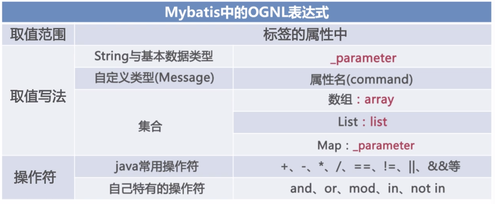
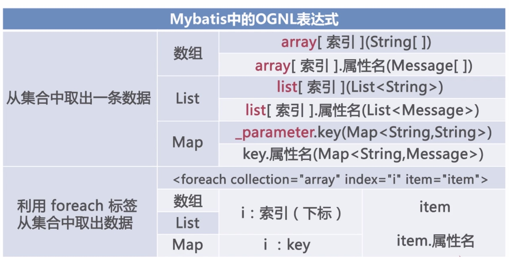

## Mybatis 基础教程

### Mybatis的下载搭建以及核心架构：

下载jar包，使用maven的话，引入具体的坐标就好

### 基本配置与执行：

基本配置文件：

```xml
<?xml version="1.0" encoding="UTF-8" ?>
<!DOCTYPE configuration
PUBLIC "-//mybatis.org//DTD Config 3.0//EN"
"http://mybatis.org/dtd/mybatis-3-config.dtd">
<!-- 配置文件的根元素 -->
<configuration>
    <!-- 属性：定义配置外在化 -->
    <properties></properties>
    <!-- 设置：定义mybatis的一些全局性设置 -->
    <settings>
       <!-- 具体的参数名和参数值 -->
       <setting name="" value=""/> 
    </settings>
    <!-- 类型名称：为一些类定义别名 -->
    <typeAliases></typeAliases>
    <!-- 类型处理器：定义Java类型与数据库中的数据类型之间的转换关系 -->
    <typeHandlers></typeHandlers>
    <!-- 对象工厂 -->
    <objectFactory type=""></objectFactory>
    <!-- 插件：mybatis的插件,插件可以修改mybatis的内部运行规则 -->
    <plugins>
       <plugin interceptor=""></plugin>
    </plugins>
    <!-- 环境：配置mybatis的环境 -->
    <environments default="">
       <!-- 环境变量：可以配置多个环境变量，比如使用多数据源时，就需要配置多个环境变量 -->
       <environment id="">
          <!-- 事务管理器 -->
          <transactionManager type=""></transactionManager>
          <!-- 数据源 -->
          <dataSource type=""></dataSource>
       </environment> 
    </environments>
    <!-- 数据库厂商标识 -->
    <databaseIdProvider type=""></databaseIdProvider>
    <!-- 映射器：指定映射文件或者映射类 -->
    <mappers>
    </mappers>
</configuration>

```

[参考链接](https://blog.csdn.net/u010107350/article/details/51292500#)

通过上述文件可以创建数据库连接

使用mybatis 的具体流程：

```java
//通过主配置文件得到一个reader，然后通过这个reader创建sqlsession工厂，然后大家sqlsession会话
Reader reader = Resources.getResourceAsReader("Configure.xml");
SqlSessionFactory sqlSessionFactory = new SqlSessionFactoryBuilder().build(reader);
SqlSession sqlSession = sqlSessionFactory.openSession();
```

配置对象的映射文件，然后就可以执行了

### 动态拼接sql   OGNL表达式

OGNL表达式：





```xml
<select id="GetUserByID" parameterType="com.mybatis.model.User" resultType="com.mybatis.model.User">
    select id, name, pwd, garde from user where 1=1
    <if test="id != 0" >
        and id=#{id}
    </if>
    <if test="name != null and !&quot;&quot;.equals(name.trim())">
        and name=#{name}  //这里嗲用变量名的方法是通过#{} 的方式来调用的
    </if>
    <if test="pwd != null and !&quot;&quot;.equals(pwd.trim())">
        and pwd like '%' #{pwd} '%' //这里模糊查询两个字符串通过空格连接
    </if>
</select>
```

