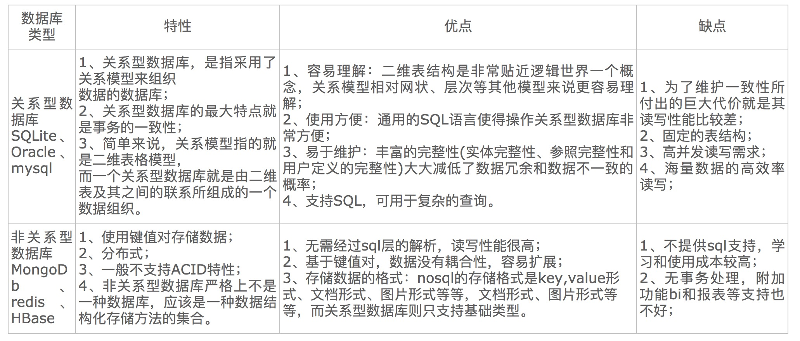

### 事务的四大特性：
(1) 原子性(Atomicity)：
     事务的原子性指的是，事务中包含的程序作为数据库的逻辑工作单位，它所做的对数据修改操作要么全部执行，要么完全不执行。这种特性称为原子性。  
(2) 一致性(Consistency) ：
    事务的一致性指的是在一个事务执行之前和执行之后数据库都必须处于一致性状态。这种特性称为事务的一致性。假如数据库的状态满足所有的完整性约束，就说该数据库是一致的。  
(3) 隔离性(Isolation)：
   隔离性指并发的事务是相互隔离的。即一个事务内部的操作及正在操作的数据必须封锁起来，不被其它企图进行修改的事务看到。假如并发交叉执行的事务没有任何控制，操纵相同的共享对象的多个并发事务的执行可能引起异常情况。  
(4) 持久性(Durability)：
   持久性意味着当系统或介质发生故障时，确保已提交事务的更新不能丢失。即一旦一个事务提交，DBMS保证它对数据库中数据的改变应该是永久性的，即对已提交事务的更新能恢复。持久性通过数据库备份和恢复来保证。  

### 数据库的隔离级别：
由低到高分别为Read uncommitted 、Read committed 、Repeatable read 、Serializable 。而且，在事务的并发操作中可能会出现脏读，不可重复读，幻读。  
* Read uncommitted：
  读未提交，顾名思义，就是一个事务可以读取另一个未提交事务的数据  
  分析：实际程序员这个月的工资还是3.6万，但是程序员看到的是3.9万。他看到的是老板还没提交事务时的数据。这就是脏读。  
  那怎么解决脏读呢？Read committed！读提交，能解决脏读问题。

  <u>**实现方式：**读不加锁，写加行级共享锁</u>

* Read committed：
  读提交，顾名思义，就是一个事务要等另一个事务提交后才能读取数据。  
  分析：这就是读提交，若有事务对数据进行更新（UPDATE）操作时，读操作事务要等待这个更新操作事务提交后才能读取数据，可以解决脏读问题。但在这个事例中，出现了一个事务范围内两个相同的查询却返回了不同数据，这就是不可重复读。  
  那怎么解决可能的不可重复读问题？Repeatable read ！  

  <u>**实现方式：**读上加行级共享锁，也就是在读数据的时候加锁，读完数据就释放，写加行级独占锁</u>

* Repeatable read：
  重复读，也就是当一个事务开启的时候，就不允许修改数据了
  分析：重复读可以解决不可重复读问题。写到这里，应该明白的一点就是，不可重复读对应的是修改，即UPDATE操作。但是可能还会有幻读问题。因为幻读问题对应的是插入INSERT操作，而不是UPDATE操作。

  <u>**实现方式：**读的事物上加行级共享锁，在读数据的事物开始的时候就加锁，事务结束才释放，写加行级独占锁</u>

* Serializable：
  Serializable 是最高的事务隔离级别，在该级别下，事务串行化顺序执行，可以避免脏读、不可重复读与幻读。但是这种事务隔离级别效率低下，比较耗数据库性能，一般不使用。  

  <u>**实现方式：**读加表级共享锁，写加表级独占锁</u>

值得一提的是：大多数数据库默认的事务隔离级别是Read committed，比如Sql Server , Oracle。Mysql的默认隔离级别是Repeatable read。

### Mysql的数据库原理：
mysql顶层有连接池，这个类似于线程池，用来在并发的时候进行数据库的操作。当sql语句读取到Mysql中时，有一层封装层用来拆分sql语句，比在处理之后将结果返回提供给上层，做了一层封装层；在这层封装层下面是语句的过滤器，会将分段的语句过滤，如果有的地方不和语法就会报错返回；再下面是优化器，一条语句究竟用什么索引，怎么用索引，怎么去执行，在这一层会给出执行计划；在这一层还有缓存，当一条语句查询完毕后结果会存放在缓存中，如果是同样的语句那么就不会再次执行了。再下面是执行引擎，之后就是数据文件了。

### mysql的存储引擎及使用场景：
1.MyISAM: 是旧版本mysql的默认引擎，现在默认引擎是InnoDB。MyISAM引擎的主要特点就是快，没有事务处理操作，也不支持外键操作。适合于多读取插入，少更新删除的操作表。存储数据分成三个文件：.frm(存储表定义) .MYD(存储数据)  .MYI(存储索引)  
用法： engine=myisam default charset=utf-8 ;

2.InnoDB：是新版本mysql的默认引擎，支持事务处理和外键，但是其缺点几就是慢了些。存储方式分为两种：1.共享表空间存储。[.frm(表结构) 和 innodb_data_home(数据)和innodb_data_file_path(索引)]   2.多表空间存储。 [.frm(表结构) 和 .idb（数据）  ]。  
 适用于对于事务由较高要求的表的创建。  
用法：engine=innodb default charset=utf-8 ;

3.MEMORY：数据访问非常快的引擎，存储格式同一放在内存中的一个磁盘文件中格式是.frm 。默认使用hash索引。一旦服务器关闭表中的数据就会丢失。数据大小有限制。  
用法：engine=memory ;

4.MERGE：本身是融合的意思，实质是MyISUM表的融合，这些融合的表必须结构完全相同。MERGE本身是没有数据的。插入操作可以是first或者是last。删除只是删除MERGE表定义，并不删除真正表的数据。存储方式：.frm(文件存储表定义信息)  .MRG(描述组合表的信息，比如由哪些表组成，插入时的依据)。  
适用于：将一系列等同的MyISAM表逻辑方式组合在一起，作为一个对象引用它们。  
用法：engine=merge union=(__,__) insert_method=last/first ;

### InnoDb与MyISAM的区别?
* InnoDB支持事务，MyISAM不支持，对于InnoDB每一条SQL语言都默认封装成事务，自动提交，这样会影响速度，所以最好把多条SQL语言放在begin和commit之间，组成一个事务；
* InnoDB是聚集索引，数据文件是和索引绑在一起的，必须要有主键，通过主键索引效率很高。但是辅助索引需要两次查询，先查询到主键，然后再通过主键查询到数据。因此，主键不应该过大，因为主键太大，其他索引也都会很大。而MyISAM是非聚集索引，数据文件是分离的，索引保存的是数据文件的指针。主键索引和辅助索引是独立的。
* InnoDB不保存表的具体行数，执行select count(*) from table时需要全表扫描。而MyISAM用一个变量保存了整个表的行数，执行上述语句时只需要读出该变量即可，速度很快；
* Innodb不支持全文索引，而MyISAM支持全文索引，查询效率上MyISAM要高；
* InnoDB支持行级锁，而MyISAM支持表级锁  
* InnoDB支持MVCC, 而MyISAM不支持  
* InnoDB支持外键，而MyISAM不支持  

### 如何选择?
* 是否要支持事务，如果要请选择innodb，如果不需要可以考虑MyISAM；
* 如果表中绝大多数都只是读查询，可以考虑MyISAM，如果既有读写也挺频繁，请使用InnoDB。
* 系统奔溃后，MyISAM恢复起来更困难，能否接受；
* MySQL5.5版本开始Innodb已经成为Mysql的默认引擎(之前是MyISAM)，说明其优势是有目共睹的，如果你不知道用什么，那就用InnoDB，至少不会差。

### innodb引擎的4大特性
* 插入缓冲（insert buffer)：将多次的插入操作缓存起来，然后执行一次性插入，避免多次IO，提高数据库的读写速率

* 二次写(double write)：将脏数据放到double write buffer中，这个缓冲区的大小是2M，它分为两次写入到磁盘中，避免缓存带来的数据问题

* 自适应哈希索引(ahi)：InnoDb会监控对表上索引的查找，如果观察到建立哈希索引可以带来速度上的提升，则建立哈希索引，这就称为自适应

* 预读(read ahead)：有两种预读方式，一种是 Linear read ahead，由参数innodb_read_ahead_threshold控制，当你连续读取一个 extent 的 threshold 个 page 的时候，会触发下一个 extent 64个page的预读。另外一种是Random read-ahead，由参数innodb_random_read_ahead控制，当你连续读取设定的数量的page后，会触发读取这个extent的剩余page。

   预读， 是一个后台进程，这种东西，知道就行

### InnoDB的好处：
1. 更新密集的表。InnoDB存储引擎特别适合处理多重并发的更新请求。
2. 事务。InnoDB存储引擎是支持事务的标准MySQL存储引擎。
3. 自动灾难恢复。与其它存储引擎不同，InnoDB表能够自动从灾难中恢复。
4. 外键约束。MySQL支持外键的存储引擎只有InnoDB。
5. 支持自动增加列AUTO_INCREMENT属性
6. 热备份。

### innodb的事务与日志的实现方式
错误日志：记录出错信息，也记录一些警告信息或者正确的信息。  
查询日志：记录所有对数据库请求的信息，不论这些请求是否得到了正确的执行。  
慢查询日志：设置一个阈值，将运行时间超过该值的所有SQL语句都记录到慢查询的日志文件中。  
二进制日志：记录对数据库执行更改的所有操作。  
中继日志：  
事务日志：  

<u>笔者想要说明的一个点是，要学会查看慢查询日志</u>

### 索引有B+索引和hash索引，各自的区别?
B+树是一个平衡的多叉树，从根节点到每个叶子节点的高度差值不超过1，而且同层级的节点间有指针相互链接。  
在B+树上的常规检索，从根节点到叶子节点的搜索效率基本相当，不会出现大幅波动，而且基于索引的顺序扫描时，也可以利用双向指针快速左右移动，效率非常高。  

哈希索引就是采用一定的哈希算法，把键值换算成新的哈希值，检索时不需要类似B+树那样从根节点到叶子节点逐级查找，只需一次哈希算法即可立刻定位到相应的位置，速度非常快。
区别：
* 如果是等值查询，那么哈希索引明显有绝对优势，因为只需要经过一次算法即可找到相应的键值；当然了，这个前提是，键值都是唯一的。如果键值不是唯一的，就需要先找到该键所在位置，然后再根据链表往后扫描，直到找到相应的数据；

* 从示意图中也能看到，如果是范围查询检索，这时候哈希索引就毫无用武之地了，因为原先是有序的键值，经过哈希算法后，有可能变成不连续的了，就没办法再利用索引完成范围查询检索；

* 同理，哈希索引也没办法利用索引完成排序，以及like ‘xxx%’ 这样的部分模糊查询（这种部分模糊查询，其实本质上也是范围查询）；

* 哈希索引也不支持多列联合索引的最左匹配规则；

* B+树索引的关键字检索效率比较平均，不像B树那样波动幅度大，在有大量重复键值情况下，哈希索引的效率也是极低的，因为存在所谓的哈希碰撞问题。

### 最左前缀原则：
最左前缀：当创建复合索引的时候，如果查询的语句中带有创建复合索引时最左边的列，那么就会使用索引。

**假设创建一个复合索引（name, pwd, garde）,那么使用name/name,garde/garde,name/name,pwd,garde/garde,name,pwd 都能使用索引**

注：在创建多列索引时，要根据业务需求，where子句中使用最频繁的一列放在最左边。

### 一个6亿的表a，一个3亿的表b，通过外间tid关联，你如何最快的查询出满足条件的第50000到第50200中的这200条数据记录。
1、如果A表TID是自增长,并且是连续的,B表的ID为索引  
select * from a,b where a.tid = b.id and a.tid>500000 limit 200;  

2、如果A表的TID不是连续的,那么就需要使用覆盖索引.TID要么是主键,要么是辅助索引,B表ID也需要有索引。  
select * from b , (select tid from a limit 50000,200) a where b.id = a .tid;  

### 索引的区别及分类：
注意：索引是在存储引擎中实现的，也就是说不同的存储引擎，会使用不同的索引。MyISAM和InnoDB存储引擎：只支持BTREE索引，也就是说默认使用BTREE，不能够更换。MEMORY/HEAP存储引擎：支持HASH和BTREE索引。

1、索引我们分为四类来讲单列索引(普通索引，唯一索引，主键索引)、组合索引、全文索引、空间索引、

1.1、单列索引：一个索引只包含单个列，但一个表中可以有多个单列索引。 这里不要搞混淆了。

    1.1.1、普通索引：MySQL中基本索引类型，没有什么限制，允许在定义索引的列中插入重复值和空值，纯粹为了查询数据更快一点。
    
    1.1.2、唯一索引：索引列中的值必须是唯一的，但是允许为空值，
    
    1.1.3、主键索引：是一种特殊的唯一索引，不允许有空值。（主键约束，就是一个主键索引）

1.2、组合索引：在表中的多个字段组合上创建的索引，只有在查询条件中使用了这些字段的左边字段时，索引才会被使用，使用组合索引时遵循最左前缀集合。例如，这里由id、name和age3个字段构成的索引，索引行中就按id/name/age的顺序存放，索引可以索引下面字段组合(id，name，age)、(id，name)或者(id)。如果要查询的字段不构成索引最左面的前缀，那么就不会是用索引，比如，age或者（name，age）组合就不会使用索引查询

1.3、全文索引：全文索引，只有在MyISAM引擎上才能使用，只能在CHAR,VARCHAR,TEXT类型字段上使用全文索引，介绍了要求，说说什么是全文索引，就是在一堆文字中，通过其中的某个关键字等，就能找到该字段所属的记录行，比如有"你是个大煞笔，二货 ..." 通过大煞笔，可能就可以找到该条记录。这里说的是可能，因为全文索引的使用涉及了很多细节，我们只需要知道这个大概意思。

1.4、空间索引：空间索引是对空间数据类型的字段建立的索引，MySQL中的空间数据类型有四种，GEOMETRY、POINT、LINESTRING、POLYGON。在创建空间索引时，使用SPATIAL关键字。要求，引擎为MyISAM，创建空间索引的列，必须将其声明为NOT NULL。可能跟游戏开发有关。

### 聚集索引和非聚集索引：
聚集索引：数据行的物理顺序与列值（一般是主键的那一列）的逻辑顺序相同，一个表中只能拥有一个聚集索引。
非聚集索引：该索引中索引的逻辑顺序与磁盘上行的物理存储顺序不同，一个表中可以拥有多个非聚集索引。
除了聚集索引，都是非聚集索引，比如单列索引(普通索引，唯一索引，主键索引)、组合索引、全文索引、空间索引、

### 数据库锁：
MySQL各存储引擎使用了三种类型（级别）的锁定机制：表级锁定，行级锁定和页级锁定。  
表级锁：开销小，加锁快；不会出现死锁；锁定粒度大，发生锁冲突的概率最高，并发度最低；  
行级锁：开销大，加锁慢；会出现死锁；锁定粒度最小，发生锁冲突的概率最低，并发度也最高；      
页面锁：开销和加锁时间界于表锁和行锁之间；会出现死锁；锁定粒度界于表锁和行锁之间，并发度一般。  
适用：从锁的角度来说，表级锁更适合于以查询为主，只有少量按索引条件更新数据的应用，如Web应用；而行级锁则更适合于有大量按索引条件并发更新少量不同数据，同时又有并发查询的应用，如一些在线事务处理（OLTP）系统。  

### 关系型数据库和非关系型数据库的区别：

### 数据库设计的三大范式：
1. 第一范式（1NF）：确保每一列的原子性  
如果每一列都是不可再分的最小数据单元，则满足第一范式。  
2. 第二范式:非键字段必须依赖于键字段  
如果一个关系满足1NF，并且除了主键以外的其它列，都依赖与该主键，则满足二范式(2NF)，第二范式要求每个表只描述一件事。  
3. 第三范式：在1NF基础上，除了主键以外的其它列都不传递依赖于主键列，或者说： 任何非主属性不依赖于其它非主属性  
（在2NF基础上消除传递依赖）  

### MVCC机制：
多版本并发控制机制
### MVCC是为了解决什么问题?
* 大多数的MYSQL事务型存储引擎,如,InnoDB，Falcon以及PBXT都不使用一种简单的行锁机制.事实上,他们都和MVCC–多版本并发控制来一起使用.  
* 大家都应该知道,锁机制可以控制并发操作,但是其系统开销较大,而MVCC可以在大多数情况下代替行级锁,使用MVCC,能降低其系统开销.
### MVCC实现
MVCC是通过保存数据在某个时间点的快照来实现的. 不同存储引擎的MVCC. 不同存储引擎的MVCC实现是不同的,典型的有乐观并发控制和悲观并发控制

InnoDB的MVCC,是通过在每行记录后面保存两个隐藏的列来实现的,这两个列，分别保存了这个行的创建时间，一个保存的是行的删除时间。这里存储的并不是实际的时间值,而是系统版本号(可以理解为事务的ID)，没开始一个新的事务，系统版本号就会自动递增，事务开始时刻的系统版本号会作为事务的ID.
当执行一个事务的时候，只会针对创建事务（版本）号小于当前事务号以及删除事务（版本）号大于当前事务号的元素  

### 覆盖索引： 
一个索引包含所有查询的字段，称为覆盖索引，好处是无需全表扫描

### 索引失效的情况：
 1. 隐式转换导致索引失效.这一点应当引起重视.也是开发中经常会犯的错误.
 由于表的字段tu_mdn定义为varchar2(20),但在查询时把该字段作为number类型以where条件传给Oracle,这样会导致索引失效.
 错误的例子：select * from test where tu_mdn=13333333333;
 正确的例子：select * from test where tu_mdn='13333333333';
 2. 对索引列进行运算导致索引失效,我所指的对索引列进行运算包括(+，-，*，/，! 等)
 错误的例子：select * from test where id-1=9;
 正确的例子：select * from test where id=10;
 3. 使用Oracle内部函数导致索引失效.对于这样情况应当创建基于函数的索引.
 错误的例子：select * from test where round(id)=10; 说明，此时id的索引已经不起作用了
 正确的例子：首先建立函数索引，create index test_id_fbi_idx on test(round(id));然后 select * from test where round(id)=10; 这时函数索引起作用了
 4. 以下使用会使索引失效，应避免使用；
 a. 使用 <> 、not in 、not exist、!=
 b. like "%_" 百分号在前（可采用在建立索引时用reverse(columnName)这种方法处理）
 c. 单独引用复合索引里非第一位置的索引列.应总是使用索引的第一个列，如果索引是建立在多个列上, 只有在它的第一个列被where子句引用时，优化器才会选择使用该索引。
 d. 字符型字段为数字时在where条件里不添加引号.
 e. 当变量采用的是times变量，而表的字段采用的是date变量时.或相反情况。
 5. 不要将空的变量值直接与比较运算符（符号）比较。
 如果变量可能为空，应使用 IS NULL 或 IS NOT NULL 进行比较，或者使用 ISNULL 函数。
 6. 不要在 SQL 代码中使用双引号。
 因为字符常量使用单引号。如果没有必要限定对象名称，可以使用（非 ANSI SQL 标准）括号将名称括起来。
 7. 将索引所在表空间和数据所在表空间分别设于不同的磁盘chunk上，有助于提高索引查询的效率。
 8. Oracle默认使用的基于代价的SQL优化器（CBO）非常依赖于统计信息，一旦统计信息不正常，会导致数据库查询时不使用索引或使用错误的索引。
 一般来说，Oracle的自动任务里面会包含更新统计信息的语句，但如果表数据发生了比较大的变化（超过20%）,可以考虑立即手动更新统计信息，例如：analyze table abc compute statistics，但注意，更新   统计信息比较耗费系统资源，建议在系统空闲时执行。
 9. Oracle在进行一次查询时，一般对一个表只会使用一个索引.
 因此，有时候过多的索引可能导致Oracle使用错误的索引，降低查询效率。例如某表有索引1（Policyno）和索引2（classcode），如果查询条件为policyno = ‘xx’ and classcode = ‘xx’，则系统有可能会使用索   引2，相较于使用索引1，查询效率明显降低。
 10. 优先且尽可能使用分区索引。

### Mysql索引的底层实现原理：

[真是坑，这都会问](http://blog.codinglabs.org/articles/theory-of-mysql-index.html)

这里写下我的理解：

为什么要用B+tree来做索引？首先如果单纯的在内存中的画，红黑树的产讯效率无疑是大于b-tree的，但是索引文件如果都存在内存中的画，势必会造成大量的资源浪费，那么就需要将索引文件存储到磁盘中，众所周知的一个问题是磁盘I/O避免面临着时间的大量消耗，只能想办法尽量减少磁盘I/O的次数.

操作系统中，我们读取数据的方式，都是从主存中读取，如果主存中产生了缺页中断，就会利用一些页面置换算法来提供数据的读取，这里的页（一般4KB）就是主存和辅存进行数据交换的逻辑块，这里索引的设计者巧妙的将b-tree的Node节点设置成一页的大小，那么显而易见，每次使用索引的最大磁盘I/O次数就是高度-1。那么为什么要使用b+tree呢？其实b+树将数据全部放到树的叶子结点上，这样提高了结点的出度，就意味着树的高度再次减少，也就是说，最大磁盘I/O次数将再次减少，其次数据库中对b+tree进行了优化，就是利用指针将叶子节点连在一起，这样可以当读取某一个范围内的数据的时候，就不需要再查询了，当然此处的设计是一个著名局部数据理论，大致意思是当程序用到某一个地方的数据，那么很大程度上会使用这附近的数据。

### count(*),count(1),count(列名)的区别

**1）count(1)与count(\*)比较：**

1、如果你的数据表没有主键，那么count(1)比count(*)快
2、如果有主键的话，那主键（联合主键）作为count的条件也比count(*)要快
3、如果你的表只有一个字段的话那count(*)就是最快的啦
4、count(*) count(1) 两者比较。主要还是要count(1)所相对应的数据字段。
5、如果count(1)是聚索引,id,那肯定是count(1)快。但是差的很小的。  因为count(*),自动会优化指定到那一个字段。所以没必要去count(?)，用count(*),sql会帮你完成优化的

**2）count详解：**

1、count(*)将返回表格中所有存在的行的总数包括值为null的行，然而count(列名)将返回表格中除去null以外的所有行的总数(有默认值的列也会被计入）.
2、distinct 列名,得到的结果将是除去值为null和重复数据后的结果