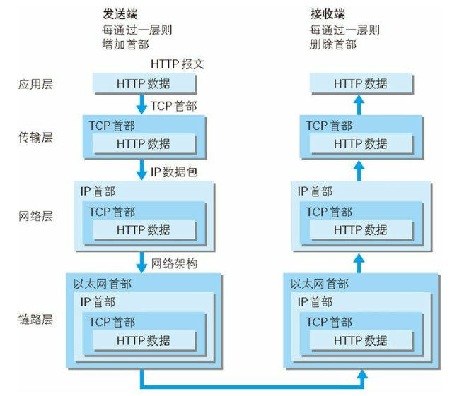

### tcp和udp的区别：
1、TCP面向连接（如打电话要先拨号建立连接）;UDP是无连接的，即发送数据之前不需要建立连接  
2、TCP提供可靠的服务。也就是说，通过TCP连接传送的数据，无差错，不丢失，不重复，且按序到达;UDP尽最大努力交付，即不保证可靠交付  
3、TCP面向字节流，实际上是TCP把数据看成一连串无结构的字节流;UDP是面向报文的UDP没有拥塞控制，因此网络出现拥塞不会使源主机的发送速率降低（对实时应用很有用，如IP电话，实时视频会议等）  
4、每一条TCP连接只能是点到点的;UDP支持一对一，一对多，多对一和多对多的交互通信  
5、TCP首部开销20字节;UDP的首部开销小，只有8个字节  
6、TCP的逻辑通信信道是全双工的可靠信道，UDP则是不可靠信道  

### Tcp三次握手：
1.TCP服务器进程先创建传输控制块TCB，时刻准备接受客户进程的连接请求，此时服务器就进入了LISTEN（监听）状态；  
2.TCP客户进程也是先创建传输控制块TCB，然后向服务器发出连接请求报文，这是报文首部中的同部位SYN=1，同时选择一个初始序列号 seq=x ，此时，TCP客户端进程进入了 SYN-SENT（同步已发送状态）状态。TCP规定，SYN报文段（SYN=1的报文段）不能携带数据，但需要消耗掉一个序号。  
3.TCP服务器收到请求报文后，如果同意连接，则发出确认报文。确认报文中应该 ACK=1，SYN=1，确认号是ack=x+1，同时也要为自己初始化一个序列号 seq=y，此时，TCP服务器进程进入了SYN-RCVD（同步收到）状态。这个报文也不能携带数据，但是同样要消耗一个序号。  
4.TCP客户进程收到确认后，还要向服务器给出确认。确认报文的ACK=1，ack=y+1，自己的序列号seq=x+1，此时，TCP连接建立，客户端进入ESTABLISHED（已建立连接）状态。TCP规定，ACK报文段可以携带数据，但是如果不携带数据则不消耗序号。  
5.当服务器收到客户端的确认后也进入ESTABLISHED状态，此后双方就可以开始通信了。  

### 为什么还要进行最后一次确认？
> 一句话，主要防止已经失效的连接请求报文突然又传送到了服务器，从而产生错误。
>如果使用的是两次握手建立连接，假设有这样一种场景，客户端发送了第一个请求连接并且没有丢失，只是因为在网络结点中滞留的时间太长了，由于TCP的客户端迟迟没有收到确认报文，以为服务器没有收到，此时重新向服务器发送这条报文，此后客户端和服务器经过两次握手完成连接，传输数据，然后关闭连接。此时此前滞留的那一次请求连接，网络通畅了到达了服务器，这个报文本该是失效的，但是，两次握手的机制将会让客户端和服务器再次建立连接，这将导致不必要的错误和资源的浪费。
>如果采用的是三次握手，就算是那一次失效的报文传送过来了，服务端接受到了那条失效报文并且回复了确认报文，但是客户端不会再次发出确认。由于服务器收不到确认，就知道客户端并没有请求连接。

### TCP四次挥手：
1.客户端进程发出连接释放报文，并且停止发送数据。释放数据报文首部，FIN=1，其序列号为seq=u（等于前面已经传送过来的数据的最后一个字节的序号加1），此时，客户端进入FIN-WAIT-1（终止等待1）状态。TCP规定，FIN报文段即使不携带数据，也要消耗一个序号。

2.服务器收到连接释放报文，发出确认报文，ACK=1，ack=u+1，并且带上自己的序列号seq=v，此时，服务端就进入了CLOSE-WAIT（关闭等待）状态。TCP服务器通知高层的应用进程，客户端向服务器的方向就释放了，这时候处于半关闭状态，即客户端已经没有数据要发送了，但是服务器若发送数据，客户端依然要接受。这个状态还要持续一段时间，也就是整个CLOSE-WAIT状态持续的时间。

3.客户端收到服务器的确认请求后，此时，客户端就进入FIN-WAIT-2（终止等待2）状态，等待服务器发送连接释放报文（在这之前还需要接受服务器发送的最后的数据）。

4.服务器将最后的数据发送完毕后，就向客户端发送连接释放报文，FIN=1，ack=u+1，由于在半关闭状态，服务器很可能又发送了一些数据，假定此时的序列号为seq=w，此时，服务器就进入了LAST-ACK（最后确认）状态，等待客户端的确认。

5.客户端收到服务器的连接释放报文后，必须发出确认，ACK=1，ack=w+1，而自己的序列号是seq=u+1，此时，客户端就进入了TIME-WAIT（时间等待）状态。注意此时TCP连接还没有释放，必须经过2∗MSL（最长报文段寿命）的时间后，当客户端撤销相应的TCB后，才进入CLOSED状态。

6.服务器只要收到了客户端发出的确认，立即进入CLOSED状态。同样，撤销TCB后，就结束了这次的TCP连接。可以看到，服务器结束TCP连接的时间要比客户端早一些。

### 为什么客户端最后还要等待2MSL？
> 
MSL（Maximum Segment Lifetime），TCP允许不同的实现可以设置不同的MSL值。

> 第一，保证客户端发送的最后一个ACK报文能够到达服务器，因为这个ACK报文可能丢失，站在服务器的角度看来，我已经发送了FIN+ACK报文请求断开了，客户端还没有给我回应，应该是我发送的请求断开报文它没有收到，于是服务器又会重新发送一次，而客户端就能在这个2MSL时间段内收到这个重传的报文，接着给出回应报文，并且会重启2MSL计时器。

> 第二，防止类似与“三次握手”中提到了的“已经失效的连接请求报文段”出现在本连接中。客户端发送完最后一个确认报文后，在这个2MSL时间中，就可以使本连接持续的时间内所产生的所有报文段都从网络中消失。这样新的连接中不会出现旧连接的请求报文。

### 为什么建立连接是三次握手，关闭连接确是四次挥手呢？

> 建立连接的时候， 服务器在LISTEN状态下，收到建立连接请求的SYN报文后，把ACK和SYN放在一个报文里发送给客户端。 
而关闭连接时，服务器收到对方的FIN报文时，仅仅表示对方不再发送数据了但是还能接收数据，而自己也未必全部数据都发送给对方了，所以己方可以立即关闭，也可以发送一些数据给对方后，再发送FIN报文给对方来表示同意现在关闭连接，因此，己方ACK和FIN一般都会分开发送，从而导致多了一次。

### http状态码：
[状态码详解](http://tool.oschina.net/commons?type=5)

### OSI七层模型：

### TCP/IP 四层模型：

* 应用层决定这次通信的应用类型，比如说FTP、DNS、SMTP等等，同时HTTP协议也属于应用层的范围。通俗来讲，应用层决定这一次通信要干嘛。  
* 传输层：传输层提供两台计算机之间的数据传输，传输层中包含着两个很叼的协议，分别是TCP和UDP协议。面试中经常提及的三次握手，四次挥手就是TCP协议的部分内容  
* 网络层：网络层则是用来处理这些流动的数据包，也就是如果把相应的数据包路由到指定的地点，为通信时的网络传输选择传输路线  
* 数据链路层：数据链路层包含了软件与硬件的接口部分，以及各种网络设备的硬件，也就是整个网络通信过程中最底层的基础设施  

### 输入域名到页面渲染的过程：
0.访问google.com，按下回车。

1.应用层准备好请求报文，通过DNS服务进行域名解析，得到google的ip地址，并将报文发到传输层。

2.传输层收到报文后，会将请求的数据包进行拆分，打包，并对每个包裹打上tag。在请求报文的基础上，加上一层TCP的首部信息，然后发往网络层。

3.到了网络层以后，IP协议就发挥了巨大的作用，IP协议中需要两个比较重要的信息，那就是ip地址和mac地址。ip已经在应用层通过dns解析出来了，通过ARP协议，它可以根据ip地址反向查询到目标主机的mac地址。然后，把数据发到数据链路层。

4.接下来数据跳转发生在一些基础设施上，此时数据包就在一根根光纤中旋转跳跃的奔向目的地，当然，整个过程不一定是直达的，可能需要经过各种中转站，就跟坐火车转车一样的。

5.请求到达服务器后，先从数据链路层往上走，并验证消去以太网首部信息，在网络层消去IP首部，在传输层消去TCP首部，就像剥洋葱一样一层一层去皮，最后剩下的就请求报文。在应用层对请求做出处理之后，需要对请求返回一个响应。而整个响应的传输过程就和请求一样，一层一层的封装，响应到达客户端时再一层一层的消去首部，最后呈现响应的结果。

### URL的最大长度：

2083个字符，超过最大长度就无法提交

### GET 和 POST的区别？

- GET在浏览器回退时是无害的，而POST会再次提交请求。
- GET产生的URL地址可以被Bookmark，而POST不可以。
- GET请求会被浏览器主动cache，而POST不会，除非手动设置。
- GET请求只能进行url编码，而POST支持多种编码方式。
- GET请求参数会被完整保留在浏览器历史记录里，而POST中的参数不会被保留。
- GET请求在URL中传送的参数是有长度限制的，而POST没有。
- 对参数的数据类型，GET只接受ASCII字符，而POST没有限制。
- GET比POST更不安全，因为参数直接暴露在URL上，所以不能用来传递敏感信息。
- GET参数通过URL传递，POST放在Request body中。

 以下是重点：

**对于GET方式的请求，浏览器会把http header和data一并发送出去，服务器响应200（返回数据）；**

**而对于POST，浏览器先发送header，服务器响应100 continue，浏览器再发送data，服务器响应200 ok（返回数据）。**

### http和https的区别：

http+加密+认证+完整性保护 = https

### SSL和TLS的区别与联系：

TLS是基于SSL3.0而来的。。。

TLS的最大优势就在于：TLS是独立于应用协议。高层协议可以透明地分布在TLS协议上面。

1.TLS与SSL的差异

　　1）版本号：TLS记录格式与SSL记录格式相同，但版本号的值不同，TLS的版本1.0使用的版本号为SSLv3.1。

　　2）报文鉴别码：SSLv3.0和TLS的MAC算法及MAC计算的范围不同。TLS使用RFC-2104定义的HMAC算法。SSLv3.0使用了相似的算法，两者差别在于SSLv3.0中，填充字节与密钥之间采用的是连接运算，而HMAC算法采用的异或运算。但是两者的安全程度是相同的。

　　3）伪随机函数：TLS使用了称为PRF的伪随机函数来将密钥扩展成数据块，是更安全的方式。

　　4）报警代码：TLS支持几乎所有的SSLv3.0报警代码，而且TLS还补充定义了很多报警代码，如解密失败（decryption_failed）、记录溢出（record_overflow）、未知CA（unknown_ca）、拒绝访问（access_denied）等。

　　5）密文族和客户证书：SSLv3.0和TLS存在少量差别，即TLS不支持Fortezza密钥交换、加密算法和客户证书。

　　6）certificate_verify和finished消息：SSLv3.0和TLS在用certificate_verify和finished消息计算MD5和SHA-1散列码时，计算的输入有少许差别，但安全性相当。

　　7）加密计算：TLS和SSLv3.0在计算主密值（master secret）时采用的方式不同。

　　8）填充：用户数据加密之前需要增加的填充字节。在SSL中，填充后的数据长度哟啊达到密文快长度的最小整数倍。而在TLS中，填充后的数据长度可以是密文块长度的任意整数倍（但填充的最大长度为255字节），这种方式可以防止基于对报文长度进行分析的攻击。

 

　　2.TLS的主要增强内容

　　TLS的主要目标是使SSL更安全，并使协议的规范更精确和完善。TLS在SSL v3.0的基础上，提供了以下增加内容：

　　1）更安全的MAC算法

　　2）更严密的警报

　　3）“灰色区域”规范的更明确的定义

 

　　3.TLS对于安全性的改进

　　1）对于消息认证使用密钥散列法：TLS使用“消息认证代码的密钥散列法”（HMAC），当记录在开放的网络（如因特网）上传送时，该代码确保记录不会被变更。SSLv3.0还提供键控消息认证，但HMAC比SSLv3.0使用（消息认证代码）MAC功能更安全。

　　2）增强的伪随机功能（PRF）：PRF生成密钥数据。在TLS中，HMAC定义PRF。PRF使用两种散列算法保证其安全性。如果任一算法暴露了，只要第二种算法未暴露，则数据仍然是安全的。

　　3）改进的已完成消息验证：TLS和SSLv3.0都对两个端点提供已完成的消息，该消息认证交换的消息没有被变更。然而，TLS将此已完成消息基于PRF和HMAC值之上，这也比SSLv3.0更安全。

　　4）一致证书处理：与SSLv3.0不同，TLS试图指定必须在TLS之间实现交换的证书类型。

　　5）特定警报消息：TLS提供更多的特定和附加警报，以指示任一会话端点检测到的问题。TLS还对何时应该发送某些警报进行记录。